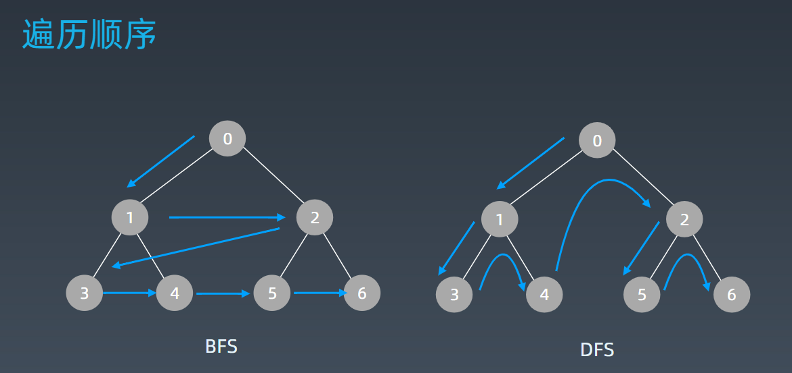

学习笔记
# 1深度优先搜索（DFS）和广度优先搜索(BFS)
## 1.1搜索需要满足的条件
* 每个节点都要访问一次
* 每个节点仅仅要访问一次
* 对于节点的访问顺序不限
    * 深度优先：depth first search
    * 广度优先：breadth first search
    * 按照优先级优先（常用于深度学习，如推荐算法）
## 1.2 DFS代码模板
多个节点时：
```python
visited = set() 
def dfs(node, visited):
    if node in visited: # terminator
    	# already visited 
    	return 

	visited.add(node) 

	# process current node here. 
	...
	for next_node in node.children(): 
		if next_node not in visited: 
			dfs(next_node, visited)
```
## 1.3 BFS代码模板
```python
def DFS(self, tree): 

	if tree.root is None: 
		return [] 

	visited, stack = [], [tree.root]
	
    while stack: 
		node = stack.pop() 
		visited.add(node)
		
        process (node) 
		
        nodes = generate_related_nodes(node) 
		stack.push(nodes) 
	# other processing work 
	...
```
## 1.4 2者遍历顺序


# 2 贪心算法
## 2.1 定义
贪心算法是一种在每一步选择中都采取在当前状态下最好或最优（即最有利）的选择，从而希望导致结果是全局最好或最优的算法。
注意：有时当下每一步最优，不一定全局最优。如果能证明每一步最优，全局就最优，就可以使用贪心算法。
## 2.2 注意事项
### 2.2.1 和动态规划比较
* 贪心：只对当前做出选择，并且不会回退
* 动态规划：会保存之前的运算结果，并且在适当时候进行回退，重新选择。
## 2.2.2 适用范围
* 贪心法可以解决一些最优化问题，如：求图中的最小生成树、求哈夫曼编码等。**然而对于工程和生活中的问题，贪心法一般不能得到我们所要求的答案。** 
* **一旦一个问题可以通过贪心法来解决，那么贪心法一般是解决这个问题的最好办法。** 由于贪心法的高效性以及其所求得的答案比较接近最优结果，贪心法也可以用作辅助算法或者直接解决一些要求结果不特别精确的问题。
* 从题目中总结；1)问题比较特殊；2)需要证明用贪心算法能够得到最优解
## 2.3 适用场景
问题能够分解成子问题来解决，子问题的最优解能递推到最终问题的最优解。这种子问题最优解称为最优子结构。
## 2.4 难点
* 在于怎么证明，可以使用贪心算法（即证明适用场景的条件满足）
* 贪心的角度不一样（如从后往前进行贪心）

# 3 二分查找
## 3.1 满足二分查找的条件（重要）
* 目标函数单调性（单调递增或者递减）
* 存在上下界（bounded）
* 能够通过索引访问（index accessible）
## 3.2 代码模板
```python
left,right=0,len(array)-1
while left<=right: 
    mid=(left +right)/2
    if array[mid]==target:
        #find the target!!
        break or return result 
    elif array[mid]<target: 
        left=mid+1
    else: 
        right=mid-1
```
注意：左边赋值+1，右边赋值-1是必须的，不然当left+1=right时，有可能mid和left或者right相等，这个循环就无法正常结束了
