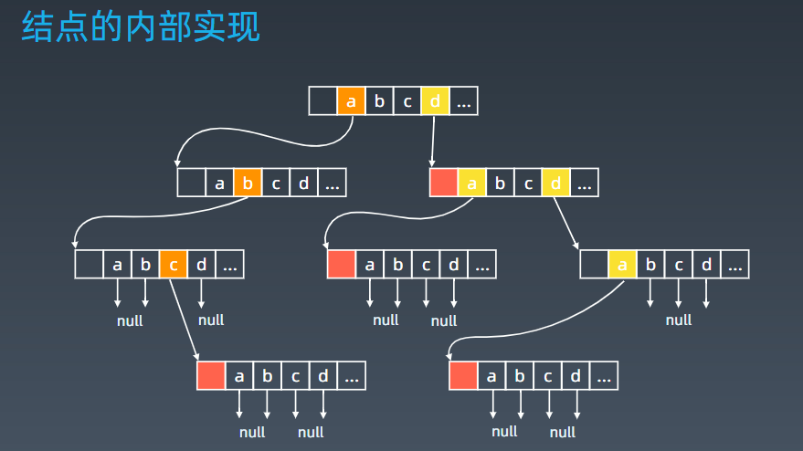

学习笔记
# 1 Trie
## 1 基本结构
字典树，即 Trie 树，又称单词查找树或键树，是一种树形结构。
* 典型应用：用于统计和排序大量的字符串（但不仅限于字符串），所以经常被搜索引擎系统用于文本词频统计。 
* 优点：最大限度地减少无谓的字符串比较，查询效率比哈希表高。
## 2 基本性质
1. 结点本身不存完整单词； 
    * 正常的树存value和下级节点
    * 这个是存一个数组：索引是字符转化的数值，元素值是对应的下级节点
    * 或者map：key是字符，value是对应下级节点
2. 从根结点到某一结点，路径上经过的字符连接起来，为该结点对应的字符串； 
3. 每个结点的所有子结点路径代表的字符都不相同。
4. 节点还可以存储额外信息，如频次等
## 3 实现

```java
/**
    trie节点实现类
 */ 
class TrieNode {

    // R links to node children
    private TrieNode[] links;

    private final int R = 26;

    private boolean isEnd;

    public TrieNode() {
        links = new TrieNode[R];
    }

    public boolean containsKey(char ch) {
        return links[ch -'a'] != null;
    }
    public TrieNode get(char ch) {
        return links[ch -'a'];
    }
    public void put(char ch, TrieNode node) {
        links[ch -'a'] = node;
    }
    public void setEnd() {
        isEnd = true;
    }
    public boolean isEnd() {
        return isEnd;
    }
}
/**
    trie的实现类
 */
class Trie {

    private TrieNode root;

    /** Initialize your data structure here. */
    public Trie() {
        root = new TrieNode();
    }
    
    /** Inserts a word into the trie. */
    public void insert(String word) {
        TrieNode node = root;
        for (int i = 0; i < word.length(); i++) {
            char currentChar = word.charAt(i);
            if (!node.containsKey(currentChar)) {
                node.put(currentChar, new TrieNode());
            }
            node = node.get(currentChar);
        }
        node.setEnd();
    }

    private TrieNode searchPrefix(String word) {
        TrieNode node = root;
        for (int i = 0; i < word.length(); i++) {
           char curLetter = word.charAt(i);
           if (node.containsKey(curLetter)) {
               node = node.get(curLetter);
           } else {
               return null;
           }
        }
        return node;
    }

    /** Returns if the word is in the trie. */
    public boolean search(String word) {
        TrieNode node = searchPrefix(word);
        return node != null && node.isEnd();

    }
    
    /** Returns if there is any word in the trie that starts with the given prefix. */
    public boolean startsWith(String prefix) {
        TrieNode node = searchPrefix(prefix);
        return node != null;
    }
}
```
## 4 核心思想
* Trie 树的核心思想是空间换时间。
* 利用字符串的***公共前缀***来降低查询时间的开销以达到提高效率的目的。

# 2 并查集 Disjoint Set
## 1 适用场景
*  组团、配对问题 
*  是否属于某个分组
## 2 基本操作
* makeSet(s)：建立一个新的并查集，其中包含 s 个单元素集合
* unionSet(x, y)：把元素 x 和元素 y 所在的集合合并，要求 x 和 y 所在的集合不相交，如果相交则不合并
* find(x)：找到元素 x 所在的集合的代表，该操作也可以用于判断两个元素是否位于同一个集合，只要将它们各自的代表比较一下就可以了
## 3 实现
* 初始化：parent指向自己
* 合并：2个集合的parent，一个指向另一个即可。
* find：可以进行路径压缩，提升查询效率
```java
class UnionFind {
    private int count = 0;
    private int[] parent;

    public UnionFind(int n) {
        count = n;
        parent = new int[n];
        for (int i = 0; i < n; i++) {
            parent[i] = i;
        }
    }

    public int find(int p) {//找对代表，即parent
        while (p != parent[p]) {
            parent[p] = parent[parent[p]];
            p = parent[p];
        }
        return p;
    }

    public void union(int p, int q) {//将一个的parent指向另一个的
        int rootP = find(p);
        int rootQ = find(q);
        if (rootP == rootQ) return;
        parent[rootP] = rootQ;
        count--;
    }
}
```
# 3 高级搜索
## 1 高级搜索有哪些
* 初级搜索：BFS,DFS
* 优化方式上：不重复（fibonacci）、剪枝（生成括号问题）
* 搜索方向上：双向搜索、启发式搜索
## 2 剪枝（略）
## 3 双向搜索
* BFS从起始节点向下和目标节点向上同时进行，遇到共同的节点搜索结束，最小深度就是2个level相加。
* 快在哪里？后半部分的遍历次数减少了，相当于剪枝了。如二叉树，10层，遍历。单向需要遍历2^10次，双向需要遍历2*(2^5)次。
## 4 启发式搜索
BFS 将队列换成优先队列，关键是如何设置估值函数。
估值函数 ：
 * 启发式函数： h(n)，它用来评价哪些结点最有希望的是一个我们要找的结点，h(n) 会返回一个非负实数,也可以认为是从结点n的目标结点路径的估计成本。 
 * 启发式函数是一种告知搜索方向的方法。它提供了一种明智的方法来猜测哪个邻居结点会导向一个目标。 
 * 举例：h(current_state) = distance(current_state, target_state) 


